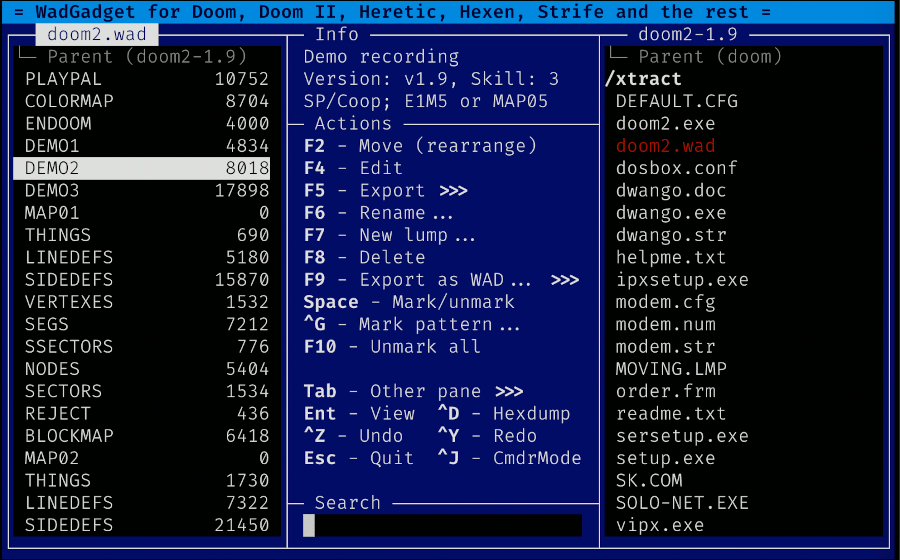

WadGadget is a love letter to TiC's [New WAD
Tool](https://doomwiki.org/wiki/New_WAD_Tool), a '90s WAD editing tool
that I continue to find useful even two decades after its last release.

The user interface is inspired both by orthodox file management tools like
[Norton Commander](https://en.wikipedia.org/wiki/Norton_Commander) but also
by the [unfinished 1.4
beta](https://doomwiki.org/wiki/New_WAD_Tool#NWT_pro_beta_release) release
of NWT which was going to have a two-pane interface for viewing two WAD
files simultaneously. The advantage of this approach in a WAD editing tool
is simple: when editing Doom WAD files, one develops PWADs as a patch
against the original IWAD file. The result is a merger between the two, and
it's helpful to be able to explore this and see the effect of one on the
other.

